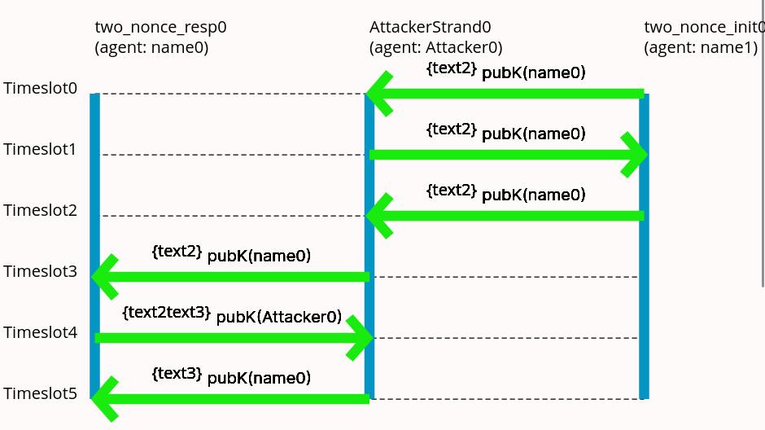

# Introduction
Dividing explanation into 2 sections, one discusses the forge file two_nonce.frg other discusses the racket file two_nonce.rkt
# Racket file
```rkt
#lang forge/domains/crypto
(defprotocol two_nonce basic
```
For (cross check this) declaring what macros are used for translating the racket code into forge predicates.
## defprotocol
The Racket file consists of a defprotcol statement inside which we define the roles in the protocol. The file also has a defskeleton statement where we define some constraints on the variables in the protocol.
### defrole init
```rkt
    (defrole init
        (vars (a b name) (n1 n2 text))
        (trace
            (send (enc n1 (pubk b)))
            (recv (enc n1 n2 (pubk a)))
            (send (enc n2 (pubk b)))
        )
    )
```
The code for describing the role consists of the role name (init in this case).
(In this case the name of the agents and the two nonces used in communication.)
The var line declares the variables used to define this protocol with their types.
The trace consists of the sequence of sends and recieves which describe the role. The terms being sent include encryption(enc),making tuples(cat) etc.
enc takes in the plaintext and key, last argument being the key, cat(tuple) of all other arguments being the plaintext.
### defrole resp
The code is similar to defrole init with send/recv interchanged as there are only two roles so one is complement of the other.
## defskeleton
This is used to define restrictions on executions of the protocol like the nonces n1,n2 being unique in origin (not generated by two agents) and the privatekeys of the agents not being leaked.
```rkt
(defskeleton two_nonce
    (vars (a b name) (n1 n2 text))
    (defstrand init 3 (a a) (b b) (n1 n1) (n2 n2))
    (non-orig (privk a) (privk b))
    (uniq-orig n1 n2)
)
```
The first line vars declares the varaibles used in the skeleton.
The defstrand line declares the role we are refering to and the mapping betweent the variable names there and the variables we defined in defstrand.
non-orig restriction says that (cross check this) the private keys of a and b are never communicated.
uniq-orig n1,n2 places the restriction that n1,n2 originate from a unique strand (originate function implemented in base.frg) which means they are only generated once.
# Forge File
```frg
#lang forge

open "two_nonce.rkt"

pred corrected_attacker_learns[d:mesg]{
    d in Attacker.learned_times.Timeslot
}
```
The corrected_attacker_learns predicate is a corrected version of the attacker_learns in the base.frg file discussed in base.md.
The #lang forge,(cross check this) used to declare whether we are using forge,froglet or temporal forge.
The open statement is for importing code from the racket file transformed into forge predicates using macros.(cross check this)
```frg
two_nonce_init_pov : run {
    wellformed

    exec_two_nonce_init
    exec_two_nonce_resp

    constrain_skeleton_two_nonce_0
```
The first line "two_nonce_init_pov: run {" gives the name of the run (two_nonce_init_pov) while the run command asks forge to find examples satisfying the predicate inside the run statement.
The wellformed predicate is from the base.frg file, these enforce all the base constraints on agent knowledge,what messages can be sent etc defined in base.frg.
The exec_two_nonce_init refers to the 'init' role in the 'two_nonce' file where exec_two_nonce_init means that there is atleast one strand executing the role init.
Similarly for exec_two_nonce_resp.
constrain_skeleton_two_nonce_0 refers to the defskeleton code we had written in two_nonce.rkt, this predicate applies those constraints. The reason we have an extra 0 at the end is we may have multiple defskeleton statements. The only way to distinguish them is by their order of defintion in the file, hence that is used here.
(Doubt: Lookup why had kept resp != init)
```frg
    two_nonce_resp.agent != two_nonce_init.agent
    //should not need restriction on a and b this time?

    //this may prevent attack have to check
    two_nonce_init.agent != AttackerStrand.agent
    two_nonce_resp.agent != AttackerStrand.agent
```
The first line stating the reponder and initiator are not the same seems no longer necessary, it was needed for some examples during debugging hence was included here. (Current guess is that attack would not be possible in that case hence is not needed when asking to look for attack in this case).
The two_nonce_init.agent != AttackerStrand.agent and the line following it ensures the initiator and responder are not the attacker itself as in that case the attacker already knows the secret.(This is not true for all the examples generated but for one of them).

```frg
    //prevents responder from sending same nonce again
    two_nonce_resp.two_nonce_resp_n1 != two_nonce_resp.two_nonce_resp_n2
    //prevents attacker from sending duplicate n1,n2 in a run of protocol
    two_nonce_init.two_nonce_init_n1 != two_nonce_init.two_nonce_init_n2
```
Here we enforce the constraint that the nonces n1,n2 are distinct. On removing this constraint one of the examples generated included only one nonce when initiator should be receiving two nonces. (Current explantion attacker sends the two nonces text2,text2 which in a set would be just text2 and same thing happens on the initiator end).

```frg
    //finding attack where init beleives it is talking to resp
    //but attacker knows the nonce
    two_nonce_init.two_nonce_init_b = two_nonce_resp.agent
    corrected_attacker_learns[two_nonce_init.two_nonce_init_n2]
```
This part contains the actual constraints for finding the attack. The initiator belives he is talking to the respondor and the attacker learns the nonce init is trying to communicate.
```frg
    exactly 6 Timeslot,25 mesg,
    exactly 1 KeyPairs,exactly 6 Key,exactly 6 akey,0 skey,
    exactly 3 PrivateKey,exactly 3 PublicKey,

    exactly 3 name,exactly 6 text,exactly 10 Ciphertext,
    exactly 1 two_nonce_init,exactly 1 two_nonce_resp,
    1 Int
```
Since forge performs bounded searches we now give the constraints for the number of elements in each set(type). When removing some of these exactly constraints however the visualization seems to break.
Additionly removing some of the exaclty constrains requires increasing the number of bits allocated to Int,(confirm: used to count number of elements(isn't always needed confusingly enough)).

